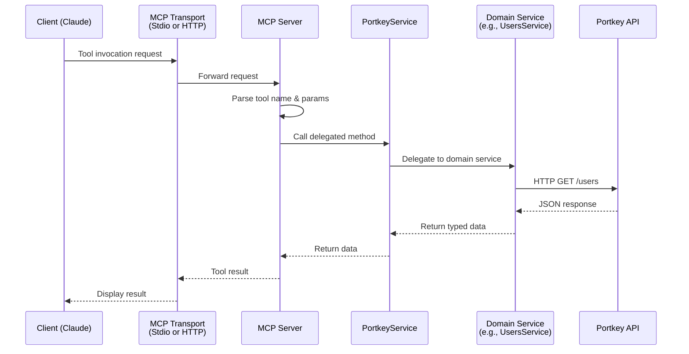

<div align="center">

# Portkey Admin MCP Server

[](https://git.io/typing-svg)

MCP server for Portkey Admin API. **116 tools** for prompts, configs, analytics & more.

</div>

<p align="center">
  <a href="https://www.npmjs.com/package/portkey-admin-mcp"></a>
  <a href="https://www.npmjs.com/package/portkey-admin-mcp"></a>
  <a href="https://nodejs.org/"></a>
  <a href="https://www.typescriptlang.org/"></a>
  <a href="https://modelcontextprotocol.io/"></a>
</p>

<p align="center">
  <a href="https://github.com/s-b-e-n-s-o-n/portkey-admin-mcp/stargazers"></a>
  <a href="https://github.com/s-b-e-n-s-o-n/portkey-admin-mcp/issues"></a>
  <a href="https://github.com/s-b-e-n-s-o-n/portkey-admin-mcp/pulls"></a>
  <a href="https://github.com/s-b-e-n-s-o-n/portkey-admin-mcp/commits"></a>
</p>

<p align="center">
  <a href="https://opensource.org/licenses/MIT"></a>
  <a href="./ENDPOINTS.md"></a>
  <a href="https://github.com/sponsors/s-b-e-n-s-o-n"></a>
</p>

---

## 📑 Contents

- [🚀 Quick Start](#-quick-start)
- [✨ Features](#-features)
- [🔧 Tools](#-tools-116)
- [🏗️ Architecture](#-architecture)
- [🚢 Deployment](#-deployment)
- [⚠️ Limitations](#-limitations)

---

## 🚀 Quick Start

**1. Clone and install:**
```bash
git clone https://github.com/s-b-e-n-s-o-n/portkey-admin-mcp.git
cd portkey-admin-mcp
npm install
npm run build
```

**2. Add to Claude config** (`~/.claude/claude_desktop_config.json`):
```json
{
  "mcpServers": {
    "portkey": {
      "command": "node",
      "args": ["/path/to/portkey-admin-mcp/build/index.js"],
      "env": {
        "PORTKEY_API_KEY": "your_api_key"
      }
    }
  }
}
```

**3. Restart Claude Desktop.**

---

## ✨ Features

<table>
<tr>
<td align="center" width="33%">
<h3>📝 Prompt Management</h3>
Create, version, render & execute prompts
</td>
<td align="center" width="33%">
<h3>⚡ Gateway Configs</h3>
Loadbalancing, fallbacks, caching
</td>
<td align="center" width="33%">
<h3>📊 Analytics</h3>
Cost, latency, errors, feedback
</td>
</tr>
<tr>
<td align="center">
<h3>🛡️ Governance</h3>
Rate limits, usage limits, guardrails
</td>
<td align="center">
<h3>🔍 Observability</h3>
Logs, traces, audit trails
</td>
<td align="center">
<h3>🔐 Access Control</h3>
Users, workspaces, API keys
</td>
</tr>
</table>

---

## 🔧 Tools (116)

<details>
<summary><strong>👥 User & Access</strong> (10 tools)</summary>

| Tool | Description |
|------|-------------|
| `list_all_users` | List all users in organization |
| `get_user` | Get user details |
| `update_user` | Update user |
| `delete_user` | Remove user |
| `invite_user` | Invite a new user |
| `list_user_invites` | List pending invites |
| `get_user_invite` | Get invite details |
| `delete_user_invite` | Cancel invite |
| `resend_user_invite` | Resend invite email |
| `get_user_stats` | Get user statistics |

</details>

<details>
<summary><strong>🏢 Workspaces</strong> (10 tools)</summary>

| Tool | Description |
|------|-------------|
| `list_workspaces` | List all workspaces |
| `get_workspace` | Get workspace details |
| `create_workspace` | Create workspace |
| `update_workspace` | Update workspace |
| `delete_workspace` | Delete workspace |
| `add_workspace_member` | Add member to workspace |
| `list_workspace_members` | List workspace members |
| `get_workspace_member` | Get member details |
| `update_workspace_member` | Update member role |
| `remove_workspace_member` | Remove member |

</details>

<details>
<summary><strong>⚙️ Configs</strong> (6 tools)</summary>

| Tool | Description |
|------|-------------|
| `list_configs` | List gateway configs |
| `get_config` | Get config details |
| `create_config` | Create config |
| `update_config` | Update config |
| `delete_config` | Delete config |
| `list_config_versions` | List config version history |

</details>

<details>
<summary><strong>🔑 API & Virtual Keys</strong> (10 tools)</summary>

| Tool | Description |
|------|-------------|
| `list_api_keys` | List API keys |
| `create_api_key` | Create API key |
| `get_api_key` | Get API key details |
| `update_api_key` | Update API key |
| `delete_api_key` | Delete API key |
| `list_virtual_keys` | List virtual keys |
| `create_virtual_key` | Create virtual key |
| `get_virtual_key` | Get virtual key details |
| `update_virtual_key` | Update virtual key |
| `delete_virtual_key` | Delete virtual key |

</details>

<details>
<summary><strong>📁 Collections</strong> (5 tools)</summary>

| Tool | Description |
|------|-------------|
| `list_collections` | List prompt collections |
| `create_collection` | Create a collection |
| `get_collection` | Get collection details |
| `update_collection` | Update collection |
| `delete_collection` | Delete collection |

</details>

<details>
<summary><strong>📝 Prompts</strong> (12 tools)</summary>

| Tool | Description |
|------|-------------|
| `list_prompts` | List prompts |
| `create_prompt` | Create a prompt template |
| `get_prompt` | Get prompt details |
| `update_prompt` | Update a prompt |
| `delete_prompt` | Delete prompt |
| `publish_prompt` | Publish prompt version |
| `list_prompt_versions` | List version history |
| `render_prompt` | Render prompt with variables |
| `run_prompt_completion` | Execute prompt completion |
| `migrate_prompt` | Create-or-update prompt |
| `promote_prompt` | Promote prompt between environments |
| `validate_completion_metadata` | Validate billing metadata |

</details>

<details>
<summary><strong>🧩 Prompt Partials</strong> (6 tools)</summary>

| Tool | Description |
|------|-------------|
| `create_prompt_partial` | Create reusable partial |
| `list_prompt_partials` | List partials |
| `get_prompt_partial` | Get partial details |
| `update_prompt_partial` | Update partial |
| `delete_prompt_partial` | Delete partial |
| `list_partial_versions` | List partial versions |
| `publish_partial` | Publish partial version |

</details>

<details>
<summary><strong>🏷️ Prompt Labels</strong> (5 tools)</summary>

| Tool | Description |
|------|-------------|
| `create_prompt_label` | Create label |
| `list_prompt_labels` | List labels |
| `get_prompt_label` | Get label details |
| `update_prompt_label` | Update label |
| `delete_prompt_label` | Delete label |

</details>

<details>
<summary><strong>🛡️ Guardrails</strong> (5 tools)</summary>

| Tool | Description |
|------|-------------|
| `list_guardrails` | List guardrails |
| `create_guardrail` | Create guardrail |
| `get_guardrail` | Get guardrail details |
| `update_guardrail` | Update guardrail |
| `delete_guardrail` | Delete guardrail |

</details>

<details>
<summary><strong>📏 Usage Limits</strong> (5 tools)</summary>

| Tool | Description |
|------|-------------|
| `list_usage_limits` | List usage limits |
| `create_usage_limit` | Create usage limit |
| `get_usage_limit` | Get limit details |
| `update_usage_limit` | Update limit |
| `delete_usage_limit` | Delete limit |

</details>

<details>
<summary><strong>⏱️ Rate Limits</strong> (5 tools)</summary>

| Tool | Description |
|------|-------------|
| `list_rate_limits` | List rate limits |
| `create_rate_limit` | Create rate limit |
| `get_rate_limit` | Get rate limit details |
| `update_rate_limit` | Update rate limit |
| `delete_rate_limit` | Delete rate limit |

</details>

<details>
<summary><strong>📜 Audit</strong> (1 tool)</summary>

| Tool | Description |
|------|-------------|
| `list_audit_logs` | List audit log entries |

</details>

<details>
<summary><strong>📊 Analytics</strong> (20 tools)</summary>

| Tool | Description |
|------|-------------|
| `get_cost_analytics` | Get cost analytics data |
| `get_analytics_summary` | Get analytics summary |
| `get_analytics_by_models` | Analytics by model |
| `get_analytics_by_metadata` | Analytics by metadata |
| `get_request_analytics` | Request analytics |
| `get_token_analytics` | Token usage analytics |
| `get_latency_analytics` | Latency analytics |
| `get_error_analytics` | Error analytics |
| `get_error_rate_analytics` | Error rate analytics |
| `get_status_code_analytics` | Status code distribution |
| `get_cache_analytics` | Cache analytics |
| `get_feedback_analytics` | Feedback analytics |
| `get_user_analytics` | Per-user analytics |
| `get_cache_hit_latency` | Cache hit latency |
| `get_cache_hit_rate` | Cache hit rate |
| `get_feedback_per_model` | Feedback per model |
| `get_feedback_score_distribution` | Score distribution |
| `get_requests_per_user` | Requests per user |
| `get_rescued_requests` | Rescued requests |
| `get_weighted_feedback` | Weighted feedback |

</details>

<details>
<summary><strong>📋 Logging</strong> (8 tools)</summary>

| Tool | Description |
|------|-------------|
| `insert_log` | Insert log entry |
| `create_log_export` | Create log export |
| `list_log_exports` | List exports |
| `get_log_export` | Get export details |
| `update_log_export` | Update export |
| `start_log_export` | Start export job |
| `cancel_log_export` | Cancel export |
| `download_log_export` | Download export |

</details>

<details>
<summary><strong>🔍 Tracing</strong> (4 tools)</summary>

| Tool | Description |
|------|-------------|
| `create_feedback` | Create feedback |
| `update_feedback` | Update feedback |
| `list_traces` | List traces |
| `get_trace` | Get trace details |

</details>

<details>
<summary><strong>🔌 Providers</strong> (5 tools)</summary>

| Tool | Description |
|------|-------------|
| `list_providers` | List providers |
| `create_provider` | Create provider |
| `get_provider` | Get provider details |
| `update_provider` | Update provider |
| `delete_provider` | Delete provider |

</details>

<details>
<summary><strong>🔗 Integrations</strong> (10 tools)</summary>

| Tool | Description |
|------|-------------|
| `list_integrations` | List integrations |
| `create_integration` | Create integration |
| `get_integration` | Get integration details |
| `update_integration` | Update integration |
| `delete_integration` | Delete integration |
| `list_integration_models` | List custom models |
| `update_integration_models` | Update custom models |
| `delete_integration_model` | Delete custom model |
| `list_integration_workspaces` | List workspace access |
| `update_integration_workspaces` | Update workspace access |

</details>

---

## 🏗️ Architecture



---

## 🚢 Deployment

### Transports

| Transport | Use Case | Default |
|-----------|----------|---------|
| `stdio` | Local CLI tools (Claude Code, Cursor) | Yes |
| `Streamable HTTP` | Remote clients, web, production | - |

Set via `MCP_TRANSPORT=stdio|http` environment variable.

### HTTP Mode

```bash
MCP_TRANSPORT=http MCP_PORT=3000 node build/index.js
```

Exposes a single `/mcp` endpoint with session management via `Mcp-Session-Id` header.

### Docker

```bash
docker build -t portkey-admin-mcp .
docker run -e PORTKEY_API_KEY=your_key -p 3000:3000 portkey-admin-mcp
```

### Health Endpoints

- `GET /health` - Server status
- `GET /ready` - Portkey API connectivity check

---

## ⚠️ Limitations

### Enterprise Features

The following require a Portkey Enterprise plan with Admin API keys:

- Analytics (cost, request, token, latency, error, cache, feedback)
- Log exports
- Audit logs
- User management (list users, invites)
- Provider creation

### Known Issues

Some endpoints are pending Portkey API clarification:

| Tool | Status | Issue |
|------|--------|-------|
| `render_prompt` | 500 | Server error - investigating |
| `create_prompt_label` | 400 | Request format unclear |
| `create_usage_limit` | 400 | Request format unclear |
| `create_rate_limit` | 400 | Request format unclear |
| `list_traces` | 405 | Endpoint path unclear |

---

<div align="center">

### Built With

[](#)
[](#)
[](#)

### Contributors

<a href="https://github.com/s-b-e-n-s-o-n/portkey-admin-mcp/graphs/contributors">
  
</a>

---

**MIT License** · Inspired by [r-huijts/portkey-admin-mcp-server](https://github.com/r-huijts/portkey-admin-mcp-server)

<a href="#portkey-admin-mcp-server">↑ Back to top</a>


</div>
